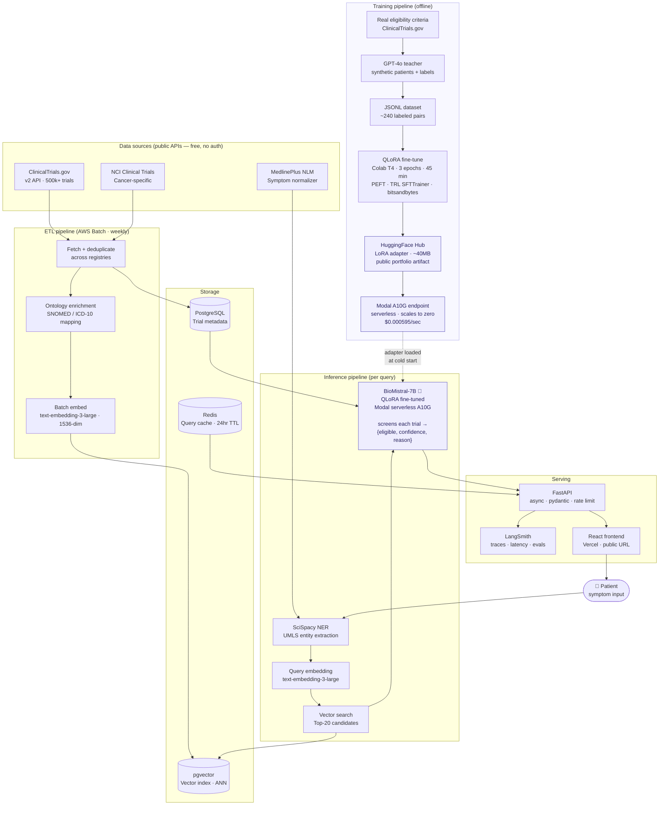

# ClinicalTrial.search

> Find open-source clinical trials by describing your symptoms in plain language.

A production-grade AI pipeline that takes a patient's free-text symptom description,
retrieves semantically similar trials from public registries, and ranks them using a
**QLoRA fine-tuned BioMistral-7B** eligibility screener — deployed on serverless GPU.

Built as a public portfolio project demonstrating the full ML lifecycle: data ingestion,
embedding, retrieval, fine-tuning, GPU deployment, and LLM observability.

---

## Demo

```
Patient: "I'm a 58-year-old man with type 2 diabetes. My A1C is 8.2 on metformin
         but still not well controlled. No kidney disease."

→ Retrieved 20 candidates from ClinicalTrials.gov + NCI
→ BioMistral-7B screened all 20 in 8.3s

#1  NCT05123456  [██████████] 94% eligible
    EMPOWER-DM: Semaglutide add-on for uncontrolled T2DM on metformin
    ✓ Met: adult patient, A1C 7.5–11%, stable metformin >3 months, no CKD
    → https://clinicaltrials.gov/study/NCT05123456

#2  NCT04891234  [████████░░] 81% eligible
    ...
```

---

## Architecture



---

## How it works

### 1. Data ingestion
A weekly Airflow job pulls from three public registries — ClinicalTrials.gov (500k+ trials),
NCI Clinical Trials API (cancer-specific), and MedlinePlus (condition name normalization).
Trials are deduplicated, enriched with SNOMED/ICD-10 ontology codes, embedded with
`text-embedding-3-large`, and stored in pgvector.

### 2. Query → retrieval
When a patient submits a symptom description:
- SciSpacy extracts clinical entities (UMLS concepts) from free text
- MedlinePlus normalizes lay terms to canonical condition names
- The query is embedded and used for ANN retrieval against pgvector
- Top-20 semantically similar trials are returned as candidates

### 3. BioMistral-7B eligibility screening
The fine-tuned model reads each (patient description, trial criteria) pair and returns:
```json
{
  "eligible": true,
  "confidence": 0.91,
  "reason": "Patient age, A1C level, and metformin history meet all inclusion criteria.",
  "key_criteria_met": ["adult patient", "A1C 7.5–11%", "stable metformin >3 months"],
  "key_criteria_failed": []
}
```
Results are sorted by confidence. Ineligible trials are filtered out.

### 4. Training pipeline (offline)
The screener was fine-tuned using teacher-student distillation:
- GPT-4o generated synthetic patient profiles for real trial criteria
- GPT-4o labeled each (patient, criteria) pair as eligible/ineligible
- BioMistral-7B was fine-tuned on these 240 pairs using QLoRA (4-bit NF4, rank 16)
- Adapter (~40MB) is hosted on HuggingFace Hub and loaded by the Modal endpoint

---

## Tech stack

| Layer | Technology |
|---|---|
| Base model | `BioMistral/BioMistral-7B` (medical domain pretrained) |
| Fine-tuning | QLoRA — PEFT + TRL SFTTrainer + bitsandbytes |
| GPU training | Google Colab T4 (free) / RunPod A10G ($0.25/hr) |
| Model serving | Modal serverless A10G · scales to zero |
| Adapter registry | HuggingFace Hub (public) |
| Embeddings | OpenAI `text-embedding-3-large` · 1536-dim |
| Vector store | pgvector (PostgreSQL extension) · ivfflat ANN |
| NER | SciSpacy `en_core_sci_lg` · UMLS concepts |
| API | FastAPI + uvicorn · async · pydantic |
| Cache | Redis · 24hr TTL · query fingerprint key |
| Observability | LangSmith · traces · latency · weekly evals |
| Frontend | React + Tailwind · Vercel |
| Orchestration | Airflow / AWS Batch · weekly sync |
| Data sources | ClinicalTrials.gov v2 · NCI · MedlinePlus · all free |

---

## Project structure

```
clinical-trial-search/
├── CLAUDE.md                     # Claude Code context file
├── README.md
├── pyproject.toml
├── .env.example
│
├── data_sources/
│   ├── clinical_trials_gov.py    # ClinicalTrials.gov v2 API client
│   ├── nci_trials.py             # NCI Cancer Trials API client
│   ├── medlineplus.py            # MedlinePlus symptom normalizer
│   └── aggregator.py             # Unified TrialAggregator
│
├── etl/
│   ├── pipeline.py               # Scheduled ingestion
│   ├── ontology.py               # SNOMED/ICD enrichment
│   └── embedder.py               # Batch embed → pgvector
│
├── models/
│   ├── finetune_pipeline.py      # GPT-4o data gen + OpenAI fine-tune
│   ├── oss_finetune.py           # QLoRA BioMistral-7B training
│   └── screener.py               # EligibilityScreener inference wrapper
│
├── serving/
│   ├── modal_endpoint.py         # Modal serverless GPU deployment
│   ├── api.py                    # FastAPI app
│   └── cache.py                  # Redis response cache
│
├── eval/
│   ├── harness.py                # LangSmith eval harness (screener)
│   ├── agent_harness.py          # LangSmith eval harness (agentic RAG)
│   ├── build_agent_golden_set.py # Generator for the 100-question agent set
│   ├── ground_agent_golden_set.py# Re-verify NCT grounding vs pgvector
│   ├── agent_golden_set.jsonl    # 100 grounded agent Q&A (patient/clinician/investor + adversarial)
│   └── golden_set.jsonl          # Screener eligibility test cases
│
├── frontend/                     # React chat UI (conversational agent)
├── finetune_data/
│   ├── train.jsonl               # 204 training examples
│   └── val.jsonl                 # 36 validation examples
│
└── outputs/
    └── qlora-biomistral/adapter/ # Saved LoRA weights
```

---

## Quickstart

### Prerequisites
```bash
pip install transformers peft bitsandbytes trl datasets accelerate openai requests fastapi uvicorn redis
```

### Environment
```bash
cp .env.example .env
# fill in OPENAI_API_KEY, DATABASE_URL, REDIS_URL, MODAL_TOKEN_ID, MODAL_TOKEN_SECRET
```

### Run the API locally
```bash
# Start FastAPI dev server
uvicorn serving.api:app --reload

# Test a search
curl -X POST http://localhost:8000/search \
  -H "Content-Type: application/json" \
  -d '{"symptoms": "chest pain shortness of breath", "max_results": 5}'
```

### Generate training data + fine-tune
```bash
# 1. Generate labeled pairs with GPT-4o (~$5)
python models/finetune_pipeline.py --stage data

# 2. Fine-tune BioMistral-7B via QLoRA (free on Colab T4)
python models/oss_finetune.py --train --model BioMistral/BioMistral-7B --epochs 3

# 3. Evaluate adapter vs base model
python models/oss_finetune.py --eval --adapter ./outputs/qlora-biomistral/adapter

# 4. Push adapter to HuggingFace Hub
python models/oss_finetune.py --push --hub-repo yourusername/clinical-trial-eligibility-screener
```

### Deploy to Modal
```bash
# Install Modal
pip install modal
modal setup

# Deploy BioMistral endpoint (serverless A10G)
modal deploy serving/modal_endpoint.py

# Test the deployed endpoint
modal run serving/modal_endpoint.py::BioMistralScreener.screen \
  --patient "58-year-old male, T2DM, A1C 8.2, on metformin" \
  --criteria "Inclusion: T2DM, HbA1c 7.5-11%, metformin stable >3 months. Exclusion: eGFR <45."
```

---

## API reference

### `POST /search`

```json
{
  "symptoms": "string — patient's free-text description",
  "max_results": 5,
  "status_filter": "RECRUITING"
}
```

Response:
```json
{
  "query_id": "uuid",
  "normalized_condition": "Type 2 Diabetes Mellitus",
  "candidates_retrieved": 20,
  "results": [
    {
      "nct_id": "NCT05123456",
      "title": "EMPOWER-DM: Semaglutide Add-on Therapy",
      "eligible": true,
      "confidence": 0.94,
      "reason": "All inclusion criteria met; no exclusion criteria triggered.",
      "key_criteria_met": ["adult patient", "A1C 7.5–11%", "stable metformin"],
      "key_criteria_failed": [],
      "url": "https://clinicaltrials.gov/study/NCT05123456"
    }
  ],
  "latency_ms": 2340
}
```

### `GET /health`
```json
{ "status": "ok", "model": "BioMistral-7B-QLoRA", "version": "1.0.0" }
```

---

## Cost

| Component | Cost |
|---|---|
| Training data generation (GPT-4o, 240 examples) | ~$5 one-time |
| QLoRA fine-tuning (Colab T4) | $0 |
| Modal GPU serving (A10G, pay-per-call) | ~$0.002 per 20-trial batch |
| PostgreSQL + Redis (AWS free tier / Railway) | ~$0–20/mo |
| Vercel frontend | $0 |
| **Total to run demo scale** | **~$20–30/mo** |

---

## Resume signal

| Skill | Evidence in this project |
|---|---|
| RAG pipeline | Embed → ANN retrieval → LLM re-rank |
| Medical NLP / NER | SciSpacy UMLS extraction + MedlinePlus normalization |
| OSS LLM fine-tuning | QLoRA on BioMistral-7B, 4-bit NF4, PEFT + TRL |
| Synthetic data generation | GPT-4o teacher → student distillation pattern |
| Serverless GPU deployment | Modal A10G endpoint, cold start + scale-to-zero |
| Production ETL | AWS Batch weekly sync, ontology enrichment, dedup |
| Vector DB design | pgvector, ivfflat index, embedding strategy |
| LLM observability | LangSmith traces + weekly golden-set eval harness |
| Full-stack deployment | FastAPI + React + Vercel, public URL with real traffic |

---

## Data sources

All data sources are public, free, and require no authentication:

- **ClinicalTrials.gov** — [API docs](https://clinicaltrials.gov/data-api/api)
- **NCI Clinical Trials** — [API docs](https://clinicaltrials.cancer.gov/api/v1/docs)
- **MedlinePlus NLM** — [API docs](https://wsearch.nlm.nih.gov/ws/query)
- **BioMistral-7B** — [HuggingFace](https://huggingface.co/BioMistral/BioMistral-7B)

---

## License

MIT
